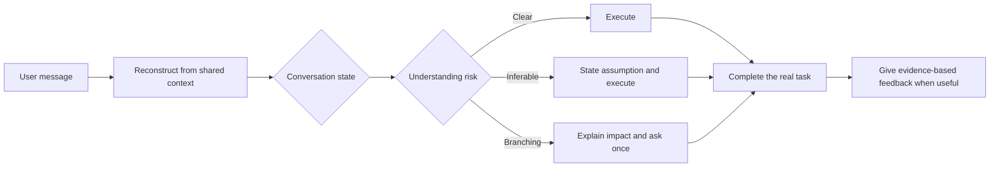

<p align="center">
  
</p>

<h1 align="center">AI Communication Coach（AI 沟通教练）</h1>

<p align="center">
  <strong>Does AI keep misunderstanding you?</strong><br>
  Sometimes the model is limited. Sometimes the user and the AI started from different interpretations of the task.
</p>

<p align="center">
  A Codex Skill that aligns intent inside real work and helps people improve the reasoning and precision behind their requests.
</p>

<p align="center">
  <a href="README.md">简体中文</a> ·
  <a href="#install">Install</a> ·
  <a href="#how-it-works">How it works</a> ·
  <a href="#evidence">Evidence</a> ·
  <a href="CONTRIBUTING.md">Contribute</a>
</p>

## The familiar failure

- “Improve this page” turns into an unrequested structural rewrite.
- “Take a look first” is treated as permission to edit files.
- Background context is mistaken for a hard requirement.
- A settled decision is repeatedly reopened with “Should I continue?”
- After several revisions, both sides discover that the first message had two different meanings.

AI Communication Coach looks for the earliest point where intent, assumptions, evidence, or authority diverged. It then uses the least disruptive repair that keeps the task accurate.

The Skill does not assume that the user caused every misunderstanding. It distinguishes user wording, missing shared context, AI inference or execution errors, model or tool limits, and uncertainty in the outside world.

## What it does

### Reconstructs likely intent from shared context

Everyday speech omits information that is already salient. The Skill reads a request together with:

1. the user's explicit wording;
2. the active task and conversational state;
3. decisions, constraints, and authorization already established;
4. artifacts and environment evidence available to both sides;
5. ordinary pragmatic cues, such as “Can you look first?” functioning as a request to inspect.

It prefers the interpretation that fits this context with the fewest new assumptions. Shared facts, working interpretations, hypotheses, and unknowns remain separate. Hidden motives, private circumstances, identity, and permission for external actions are never invented from plausible wording alone.

### Scales alignment to the real risk

| Risk | Condition | Behavior |
| --- | --- | --- |
| **Clear** | One practical interpretation | Execute directly. |
| **Inferable** | Context supports a safe, reversible interpretation | State the working interpretation briefly and continue. |
| **Branching** | Plausible readings materially change scope, cost, deliverable, validation, or external action | Explain the alternatives and impact, recommend one, and ask once. |

Risk is judged for the next authorized step. A later implementation choice does not block an already authorized inspection or evidence review.

### Recognizes the conversational state

- **Executing:** align only as much as the task requires.
- **Exploring:** preserve useful possibilities instead of forcing an early choice.
- **Reflecting:** respond to the experience before turning it into a brief.
- **Repairing or changing direction:** incorporate the correction and distinguish a repaired misunderstanding from a new decision.

### Helps the user improve through real work

When wording or reasoning materially changes the result, the Skill can give concise feedback using:

`evidence → pattern → consequence → correction → later observation`

It focuses on goals, assumptions, causal links, scope, priorities, and completion criteria. It does not assign exercises or turn ordinary messages into lessons.

## Example

**User:** Improve this page. It still doesn't feel premium.

**Without alignment:** The AI rewrites information architecture, interaction, copy, and mobile behavior.

**With the Skill:**

> “Premium” could mean visual polish or a structural redesign. Based on the desktop scope we already settled, I will keep the information structure and adjust typography, hierarchy, spacing, and color first.

The work continues without reopening a decided scope. The useful communication feedback is specific: “premium” expresses a judgment but not an observable standard; naming typography, spacing, hierarchy, color, or a reference makes the judgment reproducible.

## Install

### Direct Skill installation

Ask Codex:

```text
Use $skill-installer to install the root Skill from https://github.com/LeooooLiu/ai-communication-coach and name it ai-communication-coach.
```

Or run:

```bash
python3 "$HOME/.codex/skills/.system/skill-installer/scripts/install-skill-from-github.py" \
  --repo LeooooLiu/ai-communication-coach \
  --path . \
  --name ai-communication-coach
```

### Plugin installation

The v0.2.1 release includes a portable skills-only Agent Plugin. To install from the repository marketplace:

```bash
codex plugin marketplace add LeooooLiu/ai-communication-coach --ref main
codex plugin add ai-communication-coach@ai-communication-coach
```

Start a new task after installation so the host loads the new Skill.

### Invoke it

```text
Use $ai-communication-coach to review this request for consequential ambiguity,
state a safe working interpretation when possible, and continue the real task.
```

Implicit invocation is enabled for requests where communication review, retrospective diagnosis, or consequential ambiguity is central.

## How it works



The detailed operating contract is in [SKILL.md](SKILL.md). The diagnostic map is in [references/diagnostic-framework.md](references/diagnostic-framework.md).

## Evidence

### Theory foundation

The current design maps eleven traceable sources to observable behavior:

- Grice on cooperative conversation;
- Clark and Brennan on common ground and collaborative effort;
- Austin on speech acts;
- conversation analysis on repair;
- Toulmin on claims, evidence, warrants, and qualifiers;
- ISO/IEC/IEEE 29148 on requirement quality;
- ISO 24495-1 on plain language;
- Minto on conclusion-first information structure;
- Miehling et al. on conversational maxims in human-computer dialogue;
- Goodman and Frank on pragmatic interpretation as inference over speaker, language, and context;
- Bender and Koller on the boundary between linguistic form and grounded communicative intent.

See [Theory Foundations](references/theory-foundations.md) for links, adoption rules, and limits. Source count is traceability, not proof of effectiveness.

The optional corpus builder creates a private local SQLite FTS5 index. Downloaded source material stays in a Git-ignored directory and is not redistributed in the public package. See [Local Theory Corpus](research/README.md).

### Behavior evaluation

The repository includes:

- [23 general behavior cases](evals/behavioral-cases.json);
- [10 anonymized real-conversation cases](evals/real-conversation-cases.json);
- a [GPT-6 Luna run](evals/runs/2026-09-27-gpt-6-luna.md);
- a [cross-model context reconstruction run](evals/runs/2026-09-27-cross-model-context.md) covering GPT-6 Luna and GPT-5.6 Sol.
- a [multi-turn disposable workspace run](evals/runs/2026-09-27-multiturn-workspaces.md) covering staged inspection, scope continuity, and review-before-edit boundaries.
- a [published v0.2.0 artifact run](evals/runs/2026-09-27-release-artifact.md) covering checksum verification, installation, positive activation, and quiet negative use.

The cross-model run passed 18/18 context-reconstruction responses. The corrected ten-case real-conversation suite passed 10/10 on GPT-5.6 Sol. In three tool-using multi-turn tasks, every first turn preserved the no-edit boundary and every second turn produced the expected scoped file change. These results support the tested configurations and cases; they do not claim universal behavior across every model or host.

The complete structural, distribution, and release-asset evidence is recorded in [v0.2.0 release verification](docs/release-verification-v0.2.md).

Run structural validation:

```bash
uv run --with pyyaml --with jsonschema python scripts/validate_package.py
python3 scripts/build_plugin.py --check
```

## Package structure

```text
ai-communication-coach/
├── SKILL.md                         # Direct-install Skill
├── references/                      # Diagnostic, learning, examples, theory
├── research/                        # Source registry and local corpus builder
├── evals/                           # Cases and recorded model runs
├── plugin/ai-communication-coach/   # Portable skills-only Plugin tree
├── packaging/                       # Canonical manifests and vendored schema
├── scripts/                         # Validation, corpus, eval, and release tools
└── .agents/plugins/marketplace.json # Repo marketplace entry
```

## Boundaries

- Calibrate only issues that affect understanding, judgment, or execution.
- Describe observable language and reasoning patterns, not personality or intelligence.
- Reuse settled decisions unless new evidence or an explicit change appears.
- Respect requests to reduce, postpone, or disable optional coaching.
- Preserve genuine uncertainty and name its source once where it affects action.
- Keep copyrighted source documents in the user's private local cache.

## Contributing and support

Behavior changes should add or update an evaluation case. Read [CONTRIBUTING.md](CONTRIBUTING.md), report unexpected behavior through the [behavior template](https://github.com/LeooooLiu/ai-communication-coach/issues/new?template=behavior-report.yml), or start a [Discussion](https://github.com/LeooooLiu/ai-communication-coach/discussions).

Privacy, support, security, and usage terms are documented in [PRIVACY.md](PRIVACY.md), [SUPPORT.md](SUPPORT.md), [SECURITY.md](SECURITY.md), and [TERMS.md](TERMS.md).

## License

Original code, documentation, and visual assets are released under the [MIT License](LICENSE). Third-party sources retain their respective rights.
