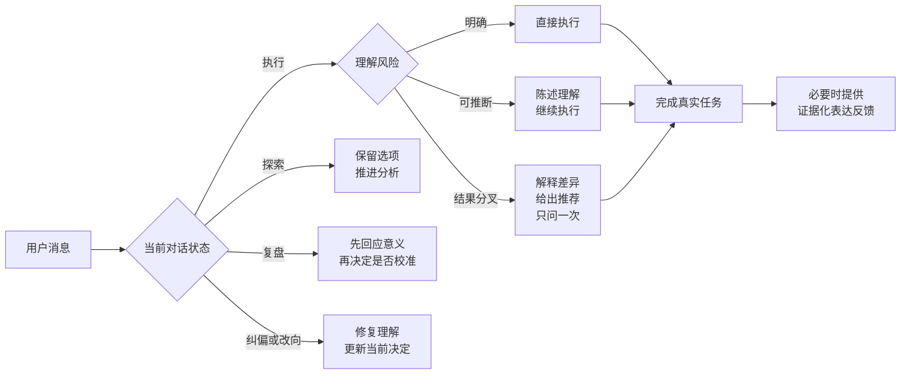

<p align="center">
  
</p>

<h1 align="center">AI Communication Coach</h1>

<p align="center">
  <strong>总觉得 AI 很笨？</strong><br>
  有时候是模型能力不够，有时候是我们和 AI 从一开始就没在理解同一件事。
</p>

<p align="center">
  一个在真实任务中找到误解、完成对齐，也帮助人逐渐把话说清楚的 Codex Skill。
</p>

<p align="center">
  <a href="https://github.com/LeooooLiu/ai-communication-coach/actions/workflows/validate.yml"></a>
  
  
  
  <a href="LICENSE"></a>
</p>

<p align="center">
  <a href="#-快速安装">快速安装</a> ·
  <a href="#-它怎样工作">工作方式</a> ·
  <a href="#-理论底座">理论底座</a> ·
  <a href="#-行为评测">行为评测</a> ·
  <a href="CONTRIBUTING.md">参与贡献</a>
</p>

## ✦ 你是不是也遇到过这些时刻？

- 你说“帮我优化一下”，AI 把你原本不想动的结构全部重做了。
- 你说“先看看这个方案”，AI 直接开始修改文件。
- 你补充了一段背景，AI 却把每一句背景都当成硬性要求。
- 你已经说清楚了范围，AI 还是不断问“要不要继续”“这样可以吗”。
- 结果不对时，你只能再解释一遍；改到第三轮，才发现双方一开始理解的就不是同一件事。

于是我们很容易得出一个结论：**这个 AI 怎么这么笨？**

## ◈ AI 不够聪明，还是我们没有把话说好？

两种情况都会发生。

模型可能缺知识、缺工具、错误推断，也可能面对本来就没有确定答案的外部事实。与此同时，人类的日常语言本来就依赖上下文：“优化一下”“和之前一样”“先看看”“做得高级一点”，对熟悉我们的同事可能足够，对 AI 却可能对应几条完全不同的执行路线。

真正需要解决的是：**这次偏差最早发生在哪里，下一步怎样用最低的沟通成本把它修回来？**

> [!IMPORTANT]
> 这个 Skill 不会预设“都是用户没说清楚”。它会区分用户表达、缺少共享背景、AI 推断或执行错误、模型与工具限制，以及外部事实本身的不确定性。只有表达确实改变了执行方向时，才给用户反馈。

## ⟡ 同一句需求，结果可以完全不同

<table>
<tr>
<th width="50%">没有及时对齐</th>
<th width="50%">使用 AI Communication Coach</th>
</tr>
<tr>
<td valign="top">
<strong>你：</strong>帮我把这个页面优化一下，感觉还不够高级。<br><br>
<strong>AI：</strong>好的，我来全面优化。<br><br>
<em>随后改了信息结构、交互、文案和移动端。</em><br><br>
<strong>你：</strong>我只是想调整桌面端视觉，怎么全改了？
</td>
<td valign="top">
<strong>你：</strong>帮我把这个页面优化一下，感觉还不够高级。<br><br>
<strong>AI：</strong>这里的“高级”可能指视觉润色，也可能指结构重做。结合你之前确定的桌面端范围，我理解为保留信息结构，先调整字体、层级、留白和色彩。我按这个方向直接修改。<br><br>
<em>任务继续推进，不重复确认已经明确的信息。</em>
</td>
</tr>
</table>

完成后，它还会留下一个可以迁移到下一次沟通的反馈：

> “高级”表达了评价，但没有提供可观察标准。把它落到视觉层级、字体、留白、色彩或参考对象上，AI 更容易稳定复现你的判断。

这套机制同时服务两个结果：

1. **当前任务少走弯路**：在真正会改变结果的位置完成对齐，然后继续执行。
2. **人的表达逐渐变准**：从真实对话中看见自己的目标、假设、因果、范围和完成标准是怎样影响结果的。

> [!TIP]
> 这不是一套要求你背诵的 Prompt 模板，也不要求你先学会“正确提问”才能使用 AI。学习发生在下一次真实协作里，而不是额外的练习中。

## ⟡ 它怎样工作



### 三档理解风险

| 等级 | 判断 | AI 行为 |
| --- | --- | --- |
| **明确** | 只有一个实际可执行方向 | 直接做，不进行仪式化复述 |
| **可推断** | 有不精确细节，但上下文支持安全、可逆的理解 | 用一两句说明工作假设，随后继续 |
| **分叉** | 不同理解会改变交付物、架构、范围、成本、验收或外部行动 | 展示解释和影响，推荐一项，请用户选择一次 |

### 四种对话状态

| 状态 | Skill 的处理方式 |
| --- | --- |
| **执行** | 对齐到足够完成任务的精度 |
| **探索** | 保留有价值的可能性，先帮助形成判断 |
| **复盘** | 先理解经验和感受，再决定是否需要表达校准 |
| **纠偏 / 改向** | 区分 AI 误解、补充信息和用户主动改变决定 |

## ✺ 核心能力

<table>
<tr>
<td width="50%" valign="top"><strong>🧭 需求对齐</strong><br><br>识别目标、产物、范围、证据、优先级、权限与完成标准，只处理会影响结果的缺口。</td>
<td width="50%" valign="top"><strong>🧠 逻辑校准</strong><br><br>发现目标与手段混淆、事实与假设混淆、因果跳跃、范围过度和冲突约束。</td>
</tr>
<tr>
<td width="50%" valign="top"><strong>🔁 多轮连续性</strong><br><br>沿用已经确认的决定；把用户改变想法视为新决定，不反复确认旧范围。</td>
<td width="50%" valign="top"><strong>⚖️ 正确归因</strong><br><br>区分用户表达、缺少上下文、AI 错误、模型或工具限制，以及外部事实本身的不确定性。</td>
</tr>
<tr>
<td width="50%" valign="top"><strong>🌱 持续反馈</strong><br><br>用“证据 → 模式 → 影响 → 修正 → 后续观察”帮助用户在真实协作中逐渐进步。</td>
<td width="50%" valign="top"><strong>🪶 低打扰</strong><br><br>反馈深度随任务调整；支持用户随时减少、延后或关闭表达点评。</td>
</tr>
</table>

## ⚡ 快速安装

### 方式一：直接让 Codex 安装

把下面这句话发给 Codex：

```text
请使用 $skill-installer 从 https://github.com/LeooooLiu/ai-communication-coach 安装根目录 Skill，名称设为 ai-communication-coach。
```

### 方式二：使用内置安装脚本

```bash
python3 "$HOME/.codex/skills/.system/skill-installer/scripts/install-skill-from-github.py" \
  --repo LeooooLiu/ai-communication-coach \
  --path . \
  --name ai-communication-coach
```

安装完成后，在下一轮对话中即可调用：

```text
Use $ai-communication-coach to 先判断我是在执行、探索、复盘还是纠偏；
需要执行时按理解风险对齐，并只反馈真正影响结果的逻辑或措辞。
```

Skill 也允许隐式调用，适合持续服务于日常协作。

## ◉ 理论底座

当前版本综合了 **9 项可追溯来源：3 本书、2 篇奠基性章节、2 篇研究论文、2 项国际标准**。

| 来源 | 在 Skill 中的用途 |
| --- | --- |
| Grice 会话合作原则 | 判断信息量、证据边界、相关性和表达清晰度 |
| Clark 与 Brennan 的共同基础理论 | 判断理解是否已经足够执行，并减少双方总沟通成本 |
| Austin 言语行为理论 | 区分查看、建议、修改、提交、发布等不同实际行动 |
| 会话分析中的修复机制 | 找到误解最早出现的位置，并优先低摩擦修复 |
| Toulmin 论证模型 | 检查主张、证据、隐含推理、限定条件和例外 |
| ISO/IEC/IEEE 29148 | 判断目标、范围、约束和完成标准能否产生一致结果 |
| ISO 24495-1 | 让信息对目标读者相关、易找、易懂并可使用 |
| Minto 金字塔原理 | 先说核心结论，再组织支持信息 |
| EMNLP 2024 人机对话准则研究 | 把经典会话原则映射到现代人机对话与透明度要求 |

完整的采用规则、来源链接与适用边界见 [Theory Foundations](references/theory-foundations.md)。这是一套基于既有研究与标准形成的设计综合；来源数量本身不作为效果证明。

> [!NOTE]
> 普通使用直接读取仓库内的理论卡片，无需联网。原始论文、预览页面和本地全文索引不会随仓库分发；运行构建脚本后，用户可以在自己的设备上建立离线 SQLite FTS5 语料库。详情见 [Local Theory Corpus](research/README.md)。

## ✓ 行为评测

仓库提供 [17 个通用行为场景](evals/behavioral-cases.json)和 [10 个匿名真实对话场景](evals/real-conversation-cases.json)，测试的不是固定措辞，而是实际动作与交互成本：

- 清楚的请求是否直接执行；
- 可推断信息是否避免无必要确认；
- 结果分叉时是否只问关键决定；
- 探索和复盘是否被错误地当成执行需求；
- AI 是否承担自己的推断错误；
- 模型知识不足是否被错误归因给用户；
- 用户关闭点评后是否得到尊重；
- 冲突约束是否被准确暴露。

```bash
uv run --with pyyaml python scripts/validate_package.py
```

结构验证不等于模型行为已经得到证明。公开声称跨模型稳定前，应分别运行这些场景并记录模型、日期、结果和失败原因。

首轮真实对话评测已记录在 [GPT-6 Luna behavior run](evals/runs/2026-09-27-gpt-6-luna.md)：初始 20 次响应发现 1 次过早提问，规则修正后目标案例 4/4 通过，必要分支对照 4/4 保留提问，自动调用路由模拟 6/6 符合预期。当前证据只支持单模型测试结论。

## ▣ 仓库结构

<details>
<summary><strong>展开查看完整结构</strong></summary>

```text
ai-communication-coach/
├── SKILL.md                       # Skill 的核心行为规则
├── README.md                      # GitHub 展示与使用说明
├── agents/openai.yaml             # Codex 展示与默认调用配置
├── assets/                        # 首页与社交分享视觉
├── evals/
│   ├── README.md                  # 评测规则
│   ├── behavioral-cases.json      # 17 个通用行为场景
│   ├── real-conversation-cases.json # 10 个匿名真实对话场景
│   └── runs/                      # 按模型与日期记录的运行结果
├── references/
│   ├── diagnostic-framework.md    # 需求诊断框架
│   ├── examples.md                # 正反例与实际对话
│   ├── learning-loop.md           # 持续反馈机制
│   └── theory-foundations.md      # 理论与来源映射
├── research/
│   ├── corpus-manifest.json       # 来源、权限与再分发信息
│   └── README.md                  # 私有语料构建说明
└── scripts/
    ├── build_corpus.py            # 下载、抽取、分块与建立索引
    ├── search_corpus.py           # SQLite FTS5 检索
    └── validate_package.py        # 公共包结构验证
```

</details>

## ◇ 设计边界

- 只纠正会影响理解、判断或执行的表达问题。
- 反馈针对可观察的语言和推理结构，不评价人格或智力。
- 真实任务继续推进，不把沟通校准变成额外课程。
- 用户已经做出的选择会被沿用，除非出现新证据或用户主动改变方向。
- 用户明确要求减少、延后或关闭点评时，遵循该偏好。
- 原始受版权保护资料保留在用户自己的 Git 忽略缓存中。

## ↗ 路线图

- [x] 三档理解风险与四种对话状态
- [x] 持续反馈与多轮决定继承
- [x] 9 项理论来源映射
- [x] 可重建的本地全文语料库
- [x] 17 个通用行为评测场景
- [x] 10 个匿名真实对话场景与单模型运行记录
- [x] GitHub Actions 包结构验证
- [ ] 目标模型完整行为评测记录
- [ ] 多模型一致性对比
- [ ] 按当前 OpenAI 规范封装为 Skill-only Plugin
- [ ] 英文完整文档

## ♡ 参与贡献

欢迎提交真实但已去除隐私的失败对话、边界案例、理论来源或更精确的判断规则。行为修改应同时增加或更新对应评测场景。

请先阅读 [CONTRIBUTING.md](CONTRIBUTING.md)，也可以前往 [Discussions](https://github.com/LeooooLiu/ai-communication-coach/discussions) 分享使用反馈。

## ☆ 如果它帮你少返工一次

- 给仓库一个 **Star**，以后可以快速找到，也能帮助更多遇到同类问题的人看到它。
- 分享一段已经去除隐私的“使用前 / 使用后”对话，这会比泛泛的好评更有价值。
- 如果它问得太多、纠正错了对象或打断了任务，请提交 [Behavior report](https://github.com/LeooooLiu/ai-communication-coach/issues/new?template=behavior-report.yml)。这些失败案例会直接进入后续评测。

## License

代码、原创文档与视觉资产以 [MIT License](LICENSE) 发布。第三方理论与来源仍归各自权利人所有；仓库只提供引用、来源说明与允许公开分发的内容。

<details>
<summary><strong>English summary</strong></summary>

AI Communication Coach is a Codex Skill that improves task alignment and the user's communication habits inside real work. It distinguishes execution, exploration, reflection, and repair; scales clarification to actual rework risk; attributes failures to the right source; and offers concise, evidence-based feedback without turning every conversation into a lesson.

Install it from the repository root as `ai-communication-coach`. The public package includes the operational Skill, theory cards, corpus builder, and behavioral evaluation cases. Downloaded source documents remain in a private Git-ignored cache.

</details>

<p align="center">
  <strong>Clearer requests. Fewer detours. Better thinking through real work.</strong>
</p>
